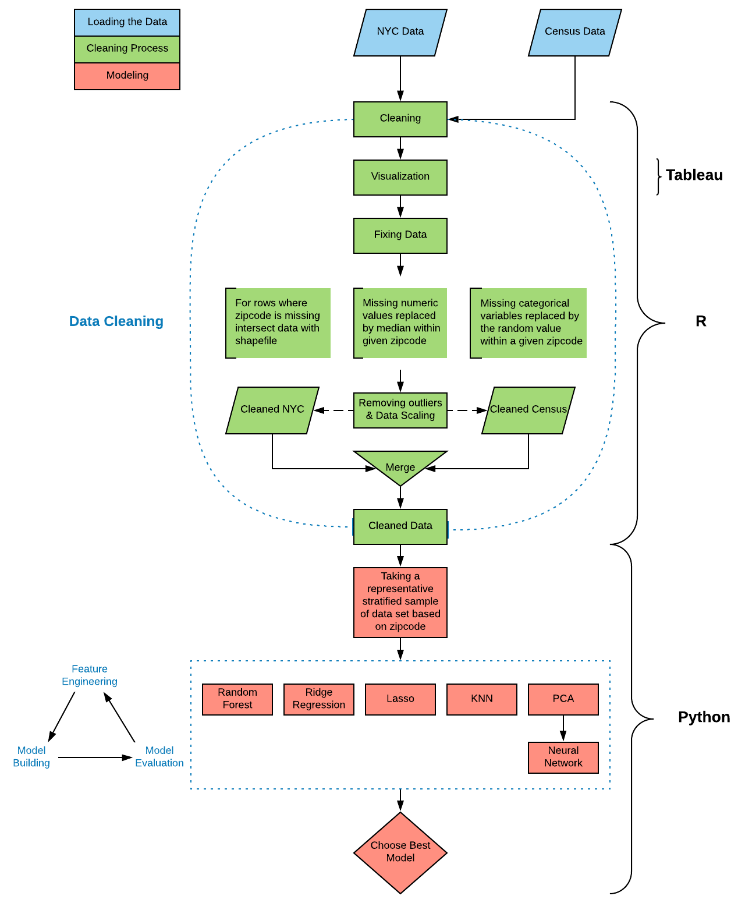

# Property Evaluation in NYC

The project was done at Texas Tech University as a Capstone project by Marcin Grzechowiak, Mikaela Pisani, Roger Valdez, Arjuna Menon and Jaimie Capps. The dataset is used from the City of New York Primary Land Use Tax Lot Output (PLUTO) 2018.

The **short version** of the Report can be found on my website [https://grzechowiak.github.io/posts/.](https://grzechowiak.github.io/posts/)

